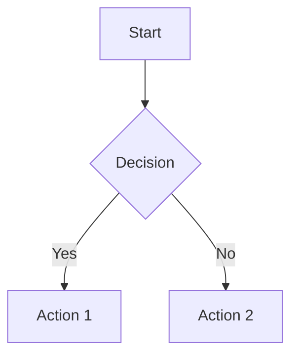

# Markdown to PDF Converter

Professional Markdown to PDF conversion with APA 7th edition formatting, Mermaid diagram support, and extensive customization options.

## Features

- **Cover Pages**: Use `[title]...[/title]` markers for professional title pages
- **Table of Contents**: Multiple variants with `[toc]`, `[toc:figures]`, `[toc:tables]`, `[toc:all]`
- **Mermaid Diagrams**: Automatic rendering with intelligent scaling
- **Callout Boxes**: GitHub-style alerts (NOTE, TIP, WARNING, IMPORTANT, CAUTION)
- **Page Breaks**: Manual control with `[pagebreak]` markers
- **Figure & Table Captions**: Proper APA-formatted captions
- **Draft Watermark**: Overlay "DRAFT" on all pages
- **Confidential Footer**: Add confidential marking with footer rule
- **Line Numbers**: Code review mode with numbered code blocks
- **Two-Column Layout**: Newsletter-style formatting
- **Custom Running Title**: Override header text
- **Bibliography Support**: APA 7th edition citations with BibTeX

## Requirements

### Required
- **Pandoc** - Document conversion engine ([Install](https://pandoc.org/installing.html))
- **XeLaTeX** or **pdfLaTeX** - PDF generation (via [TeX Live](https://tug.org/texlive/) or [MiKTeX](https://miktex.org/))
- **Times New Roman** font (included in Windows, available on macOS/Linux)

### Optional
- **Mermaid CLI** - For diagram rendering ([Install](https://github.com/mermaid-js/mermaid-cli))
  ```bash
  npm install -g @mermaid-js/mermaid-cli
  ```

## Installation

1. Clone or download this repository
2. Ensure Pandoc and a LaTeX distribution are installed
3. (Optional) Install Mermaid CLI for diagram support

## Usage

### Basic Conversion
```powershell
.\convert-to-pdf.ps1 -File "document.md"
```

### With Options
```powershell
# Draft mode with confidential footer
.\convert-to-pdf.ps1 -File "document.md" -Draft -Confidential

# Custom line spacing and running title
.\convert-to-pdf.ps1 -File "document.md" -LineSpacing 1.15 -RunningTitle "Short Title"

# Two-column layout with line numbers in code
.\convert-to-pdf.ps1 -File "document.md" -TwoColumn -LineNumbers

# Open PDF after generation
.\convert-to-pdf.ps1 -File "document.md" -OpenAfterBuild
```

## Parameters

| Parameter | Type | Default | Description |
|-----------|------|---------|-------------|
| `-File` | String | (required) | Path to the Markdown file |
| `-LineSpacing` | Double | 1.5 | Line spacing multiplier |
| `-Draft` | Switch | false | Adds "DRAFT" watermark |
| `-Confidential` | Switch | false | Adds "CONFIDENTIAL" footer |
| `-LineNumbers` | Switch | false | Shows line numbers in code blocks |
| `-TwoColumn` | Switch | false | Two-column newsletter layout |
| `-RunningTitle` | String | (from title) | Custom header text |
| `-OpenAfterBuild` | Switch | false | Opens PDF when complete |

## Markdown Extensions

### Cover Page
```markdown
[title]
# Document Title

**Author**: John Smith
January 15, 2025

Department of Examples
University Name
[/title]
```

### Table of Contents
```markdown
[toc]           <!-- Basic TOC -->
[toc:figures]   <!-- TOC + List of Figures -->
[toc:tables]    <!-- TOC + List of Tables -->
[toc:all]       <!-- TOC + Both Lists -->
```

### Page Breaks
```markdown
Content before...

[pagebreak]

Content after...
```

### Callout Boxes
```markdown
> [!NOTE]
> This is an informational note.

> [!TIP]
> This is a helpful tip.

> [!WARNING]
> This is a warning message.

> [!IMPORTANT]
> This is important information.

> [!CAUTION]
> This requires caution.
```

### Mermaid Diagrams
````markdown

````

### Figure Captions
```markdown

```

### Table Captions
```markdown
Table: This is the table caption

| Column 1 | Column 2 |
|----------|----------|
| Data     | Data     |
```

### Citations (requires bibliography.bib)
```markdown
According to research [@example2024], this is true.
@samplebook2023 provides comprehensive coverage.
```

## Project Structure

```
markdown-to-pdf/
├── convert-to-pdf.ps1      # Main conversion script
├── README.md               # This file
├── sample.md               # Example document
└── references/
    ├── apa-7th-edition.csl # APA citation style
    └── bibliography.bib    # Your references
```

## Examples

See [sample.md](sample.md) for a complete example demonstrating all features.

## Tips

1. **Diagrams not rendering?** Ensure Mermaid CLI is installed: `npm install -g @mermaid-js/mermaid-cli`
2. **Missing fonts?** Install Times New Roman or modify the script to use a different font
3. **Two-column tables look wrong?** Tables render as text in two-column mode due to LaTeX limitations
4. **Large diagrams?** The converter automatically scales diagrams to fit the page

## License

MIT License - Feel free to use and modify for your projects.
