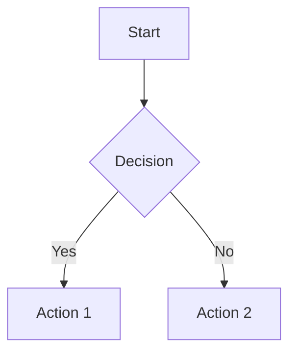

<p align="center">
  
</p>

<p align="center">
  <strong>Professional Markdown to PDF conversion with APA 7th edition formatting</strong><br>
  Mermaid diagrams • LaTeX math • Citations • Table of Contents • And more
</p>

<p align="center">
  <a href="#features">Features</a> •
  <a href="#quick-start">Quick Start</a> •
  <a href="#usage">Usage</a> •
  <a href="docs/USER_GUIDE.md">User Guide</a> •
  <a href="docs/INSTALLATION.md">Installation</a>
</p>

---

## Features

| Feature | Description |
|---------|-------------|
| 📄 **Cover Pages** | Professional title pages with `[title]...[/title]` markers |
| 📑 **Table of Contents** | Auto-generated with `[toc]`, `[toc:figures]`, `[toc:tables]`, `[toc:all]` |
| 📊 **Mermaid Diagrams** | Automatic rendering with intelligent scaling |
| 💡 **Callout Boxes** | GitHub-style alerts (NOTE, TIP, WARNING, IMPORTANT, CAUTION) |
| ➗ **LaTeX Math** | Full equation support with `$...$` and `$$...$$` |
| 📚 **Citations** | APA 7th edition bibliography with BibTeX |
| 📐 **Page Breaks** | Manual control with `[pagebreak]` markers |
| 🏷️ **Figure & Table Captions** | Proper APA-formatted captions |
| 📝 **Draft Mode** | Overlay "DRAFT" watermark on all pages |
| 🔒 **Confidential Footer** | Add confidential marking with footer rule |
| 🔢 **Line Numbers** | Code review mode with numbered code blocks |
| 📰 **Two-Column Layout** | Newsletter-style formatting |

## Quick Start

```powershell
# Basic conversion
.\convert-to-pdf.ps1 -File "document.md"

# With draft watermark and auto-open
.\convert-to-pdf.ps1 -File "document.md" -Draft -OpenAfterBuild
```

## Requirements

| Component | Required | Purpose |
|-----------|:--------:|---------|
| [Pandoc](https://pandoc.org/installing.html) | ✅ | Document conversion engine |
| [TeX Live](https://tug.org/texlive/) or [MiKTeX](https://miktex.org/) | ✅ | PDF generation (XeLaTeX/pdfLaTeX) |
| Times New Roman font | ✅ | APA formatting (included in Windows) |
| [Mermaid CLI](https://github.com/mermaid-js/mermaid-cli) | ⬜ | Diagram rendering |

**Install Mermaid CLI (optional):**

```bash
npm install -g @mermaid-js/mermaid-cli
```

> 📖 See [Installation Guide](docs/INSTALLATION.md) for detailed setup instructions.

## Usage

### Basic Conversion

```powershell
.\convert-to-pdf.ps1 -File "document.md"
```

### Common Options

```powershell
# Draft mode with confidential footer
.\convert-to-pdf.ps1 -File "document.md" -Draft -Confidential

# Custom line spacing and running title
.\convert-to-pdf.ps1 -File "document.md" -LineSpacing 1.15 -RunningTitle "Short Title"

# Two-column layout with line numbers in code
.\convert-to-pdf.ps1 -File "document.md" -TwoColumn -LineNumbers

# Open PDF after generation
.\convert-to-pdf.ps1 -File "document.md" -OpenAfterBuild
```

## Parameters

| Parameter | Type | Default | Description |
| --------- | ---- | ------- | ----------- |
| `-File` | String | (required) | Path to the Markdown file |
| `-LineSpacing` | Double | 1.5 | Line spacing multiplier |
| `-Draft` | Switch | false | Adds "DRAFT" watermark |
| `-Confidential` | Switch | false | Adds "CONFIDENTIAL" footer |
| `-LineNumbers` | Switch | false | Shows line numbers in code blocks |
| `-TwoColumn` | Switch | false | Two-column newsletter layout |
| `-RunningTitle` | String | (from title) | Custom header text |
| `-OpenAfterBuild` | Switch | false | Opens PDF when complete |

## Markdown Extensions

### Cover Page

```markdown
[title]
# Document Title

**Author**: John Smith
January 15, 2025

Department of Examples
University Name
[/title]
```

### Table of Contents

```markdown
[toc]           <!-- Basic TOC -->
[toc:figures]   <!-- TOC + List of Figures -->
[toc:tables]    <!-- TOC + List of Tables -->
[toc:all]       <!-- TOC + Both Lists -->
```

### Page Breaks

```markdown
Content before...

[pagebreak]

Content after...
```

### Callout Boxes

```markdown
> [!NOTE]
> This is an informational note.

> [!TIP]
> This is a helpful tip.

> [!WARNING]
> This is a warning message.

> [!IMPORTANT]
> This is important information.

> [!CAUTION]
> This requires caution.
```

### Mermaid Diagrams

````markdown

````

### Figure Captions

```markdown

```

### Table Captions

```markdown
Table: This is the table caption

| Column 1 | Column 2 |
| -------- | -------- |
| Data     | Data     |
```

### Citations (requires bibliography.bib)

```markdown
According to research [@example2024], this is true.
@samplebook2023 provides comprehensive coverage.
```

## Project Structure

```text
markdown-to-pdf/
├── convert-to-pdf.ps1      # Main conversion script
├── README.md               # This file
├── sample.md               # Example document
├── docs/
│   ├── INSTALLATION.md     # Setup guide
│   ├── USER_GUIDE.md       # Detailed usage
│   └── TROUBLESHOOTING.md  # Common issues
└── references/
    ├── apa-7th-edition.csl # APA citation style
    └── bibliography.bib    # Your references
```

## Documentation

- 📖 [User Guide](docs/USER_GUIDE.md) - Comprehensive feature documentation
- 🔧 [Installation](docs/INSTALLATION.md) - Detailed setup instructions
- 🐛 [Troubleshooting](docs/TROUBLESHOOTING.md) - Common issues and solutions

## Examples

See [sample.md](sample.md) for a complete example demonstrating all features.

## Tips

1. **Diagrams not rendering?** Ensure Mermaid CLI is installed: `npm install -g @mermaid-js/mermaid-cli`
2. **Missing fonts?** Install Times New Roman or modify the script to use a different font
3. **Two-column tables look wrong?** Tables render as text in two-column mode due to LaTeX limitations
4. **Large diagrams?** The converter automatically scales diagrams to fit the page

## Contributing

Contributions are welcome! See [CONTRIBUTING.md](CONTRIBUTING.md) for guidelines.

## License

MIT License - See [LICENSE](LICENSE) for details.
