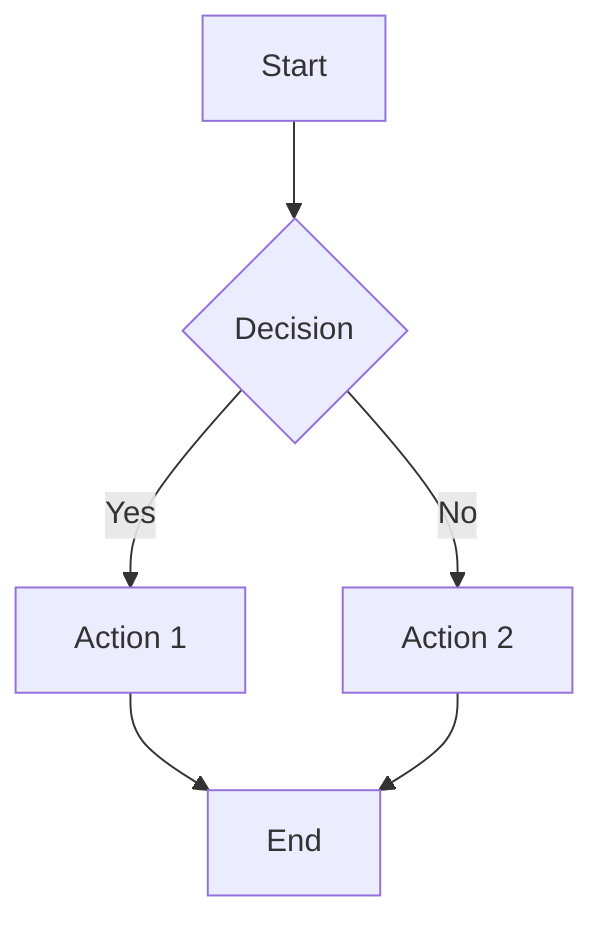
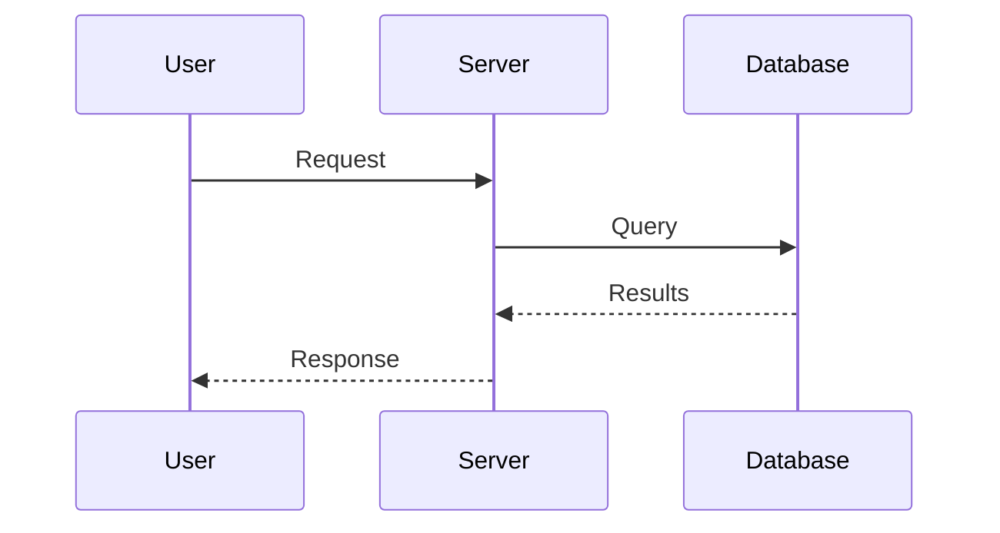
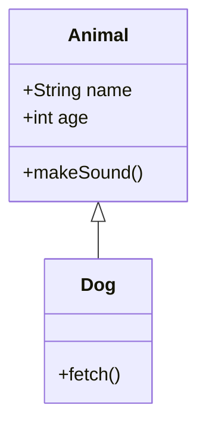
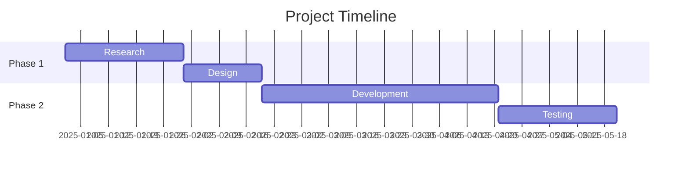
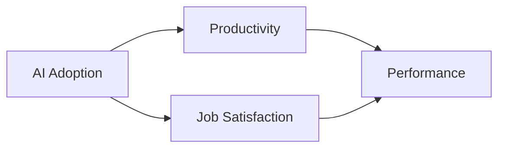
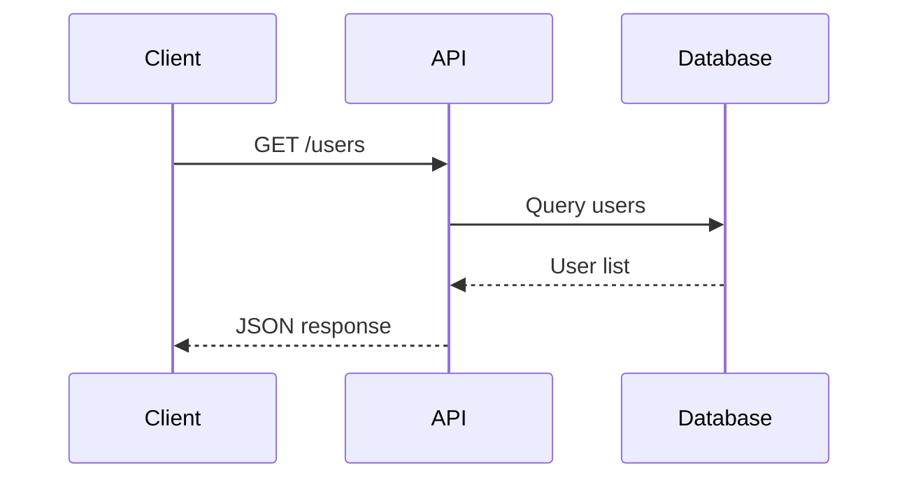
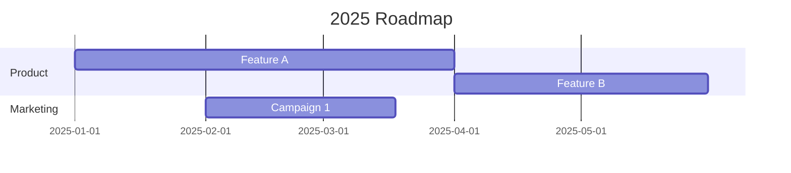

# User Guide

Complete guide to using the Markdown to PDF Converter for professional document creation.

## Table of Contents

1. [Quick Start](#quick-start)
2. [Command Line Parameters](#command-line-parameters)
3. [Markdown Extensions](#markdown-extensions)
4. [Working with Diagrams](#working-with-diagrams)
5. [Citations and Bibliography](#citations-and-bibliography)
6. [Styling and Formatting](#styling-and-formatting)
7. [Best Practices](#best-practices)
8. [Examples](#examples)

---

## Quick Start

### Basic Conversion

```powershell
.\convert-to-pdf.ps1 -File "your-document.md"
```

### With Common Options

```powershell
.\convert-to-pdf.ps1 -File "document.md" -Draft -OpenAfterBuild
```

### Full Featured

```powershell
.\convert-to-pdf.ps1 -File "document.md" -LineSpacing 1.15 -Draft -Confidential -LineNumbers -RunningTitle "Project Report" -OpenAfterBuild
```

---

## Command Line Parameters

| Parameter | Type | Default | Description |
| --------- | ---- | ------- | ----------- |
| `-File` | String | Required | Path to the Markdown file to convert |
| `-LineSpacing` | Double | 1.5 | Line spacing (1.0 = single, 1.5 = one-and-half, 2.0 = double) |
| `-Draft` | Switch | Off | Adds diagonal "DRAFT" watermark across all pages |
| `-Confidential` | Switch | Off | Adds "CONFIDENTIAL" text in footer with horizontal rule |
| `-LineNumbers` | Switch | Off | Shows line numbers in code blocks |
| `-TwoColumn` | Switch | Off | Two-column newsletter layout (tables become plain text) |
| `-RunningTitle` | String | Document title | Custom text for page header |
| `-OpenAfterBuild` | Switch | Off | Automatically opens PDF when complete |

### Parameter Examples

**Academic Paper (APA style)**

```powershell
.\convert-to-pdf.ps1 -File "thesis.md" -LineSpacing 2.0
```

**Draft Review**

```powershell
.\convert-to-pdf.ps1 -File "proposal.md" -Draft -LineNumbers -OpenAfterBuild
```

**Confidential Report**

```powershell
.\convert-to-pdf.ps1 -File "report.md" -Confidential -RunningTitle "Q4 Financial Review"
```

**Newsletter Layout**

```powershell
.\convert-to-pdf.ps1 -File "newsletter.md" -TwoColumn -LineSpacing 1.15
```

---

## Markdown Extensions

### Cover Page

Create a professional title page using the `[title]...[/title]` block:

```markdown
[title]
# Document Title

**Author**: Jane Smith
**Organization**: Acme Corporation
**Date**: January 2025

*Subtitle or additional information*
[/title]
```

**Tips:**

- Use `#` for the main title (appears large and bold)
- Use `**bold**` for labels like Author, Date
- Use `*italic*` for subtitles
- HTML `<div>` tags are stripped automatically

### Table of Contents

Insert a table of contents with optional lists:

```markdown
[toc]           <!-- Basic TOC -->
[toc:figures]   <!-- TOC + List of Figures -->
[toc:tables]    <!-- TOC + List of Tables -->
[toc:all]       <!-- TOC + List of Figures + List of Tables -->
```

**Placement:** Put the TOC marker right after the `[/title]` block or at the beginning of the document.

### Page Breaks

Force a new page:

```markdown
Content before the break...

[pagebreak]

Content on the new page...
```

### Callout Boxes

Five styled callout types using GitHub-flavored syntax:

```markdown
> [!NOTE]
> Informational content that provides additional context.

> [!TIP]
> Helpful suggestions or best practices.

> [!WARNING]
> Important warnings about potential issues.

> [!IMPORTANT]
> Critical information that must not be missed.

> [!CAUTION]
> Serious warnings about dangerous actions.
```

**Multi-line callouts:**

```markdown
> [!NOTE]
> This is the first line.
> This is the second line.
> All lines starting with > are included.
```

### Figure Captions

Images with alt text become captioned figures:

```markdown

```

**With width control:**

```markdown
{ width=50% }
```

### Table Captions

Add a caption above any table:

```markdown
Table: Sales Data by Quarter

| Quarter | Revenue | Growth |
|---------|---------|--------|
| Q1      | $1.2M   | 5%     |
| Q2      | $1.4M   | 8%     |
```

---

## Working with Diagrams

### Basic Flowchart

````markdown

````

### Sequence Diagram

````markdown

````

### Class Diagram

````markdown

````

### Gantt Chart

````markdown

````

### Diagram Scaling

The converter automatically scales diagrams to fit the page:

- Small diagrams: 100% width
- Medium diagrams: 85% width
- Large diagrams: 75% width
- Very large diagrams: Calculated to fit

No manual intervention needed.

---

## Citations and Bibliography

### Setup

1. Add references to `references/bibliography.bib`:

```bibtex
@article{smith2024,
  author = {Smith, John and Doe, Jane},
  title = {Research Findings},
  journal = {Journal of Examples},
  year = {2024},
  volume = {10},
  pages = {1-15},
  doi = {10.1234/example}
}
```

2. Use citations in your markdown

### Citation Styles

**Parenthetical citation:**

```markdown
Research supports this claim [@smith2024].
```

Output: Research supports this claim (Smith & Doe, 2024).

**Narrative citation:**

```markdown
@smith2024 found significant results.
```

Output: Smith and Doe (2024) found significant results.

**Multiple citations:**

```markdown
Several studies agree [@smith2024; @jones2023; @lee2022].
```

**Page numbers:**

```markdown
As noted [@smith2024, p. 42].
```

### Reference List

Add a References section at the end:

```markdown
## References
```

The bibliography generates automatically from cited works.

---

## Styling and Formatting

### Headers

```markdown
# Level 1 (Large, bold)
## Level 2 (Medium, bold)
### Level 3 (Normal, bold)
#### Level 4 (Normal, bold, smaller)
```

### Text Formatting

```markdown
**Bold text**
*Italic text*
***Bold and italic***
`inline code`
~~strikethrough~~
```

### Lists

**Bulleted:**

```markdown
- Item one
- Item two
  - Nested item
  - Another nested
- Item three
```

**Numbered:**

```markdown
1. First step
2. Second step
   1. Sub-step A
   2. Sub-step B
3. Third step
```

### Code Blocks

````markdown
```python
def hello():
    print("Hello, World!")
```
````

Use `-LineNumbers` flag for numbered lines.

### Blockquotes

```markdown
> This is a blockquote.
> It can span multiple lines.
```

### Horizontal Rules

```markdown
---
```

Note: Horizontal rules immediately before section headers are automatically removed.

---

## Best Practices

### Document Structure

1. Start with `[title]` block for professional cover
2. Add `[toc]` after title for navigation
3. Use consistent heading hierarchy
4. End with References section if using citations

### Diagrams

- Keep diagrams focused and readable
- Use descriptive node labels
- Test complex diagrams separately first
- Large diagrams may need manual `[pagebreak]` before them

### Tables

- Use simple pipe tables for best compatibility
- Add `Table:` caption for numbered tables
- Keep tables narrow for better formatting
- Avoid tables in `-TwoColumn` mode

### Performance

- Large documents with many diagrams take longer
- Mermaid rendering adds ~1-2 seconds per diagram
- First run may be slower (LaTeX package downloads)

### File Organization

```
project/
├── document.md
├── images/
│   ├── figure1.png
│   └── figure2.png
└── convert-to-pdf.ps1  (or reference the main script)
```

---

## Examples

### Academic Paper

```markdown
[title]
# Effects of AI on Workplace Productivity

**Author**: Dr. Jane Smith
**Institution**: University of Technology
**Date**: January 2025

Submitted in partial fulfillment of research requirements
[/title]

[toc:all]

## Abstract

This study examines...

## Introduction

Recent advances in artificial intelligence [@venkatesh2021] have...

## Methodology

### Participants

A sample of 500 professionals...

### Measures

Table: Survey Instruments Used

| Instrument | Items | Reliability |
|------------|-------|-------------|
| AI Readiness | 28 | α = .91 |
| Job Satisfaction | 12 | α = .87 |

## Results



## Discussion

The findings suggest...

## References
```

### Technical Documentation

```markdown
[title]
# API Integration Guide

**Version**: 2.0
**Last Updated**: January 2025

Technical Documentation for Development Teams
[/title]

[toc]

## Overview

> [!IMPORTANT]
> This API requires authentication for all endpoints.

## Authentication

```python
import requests

headers = {
    'Authorization': 'Bearer YOUR_TOKEN',
    'Content-Type': 'application/json'
}
```

## Endpoints

### GET /users



> [!TIP]
> Use pagination for large result sets.
```

### Business Report

```markdown
[title]
# Q4 2024 Performance Report

**Prepared for**: Executive Leadership
**Prepared by**: Analytics Team
**Date**: January 15, 2025

CONFIDENTIAL
[/title]

[toc:figures]

## Executive Summary

> [!NOTE]
> All figures represent preliminary data pending final audit.

## Financial Performance

Table: Revenue by Region

| Region | Q4 2024 | Q4 2023 | Change |
|--------|---------|---------|--------|
| North | $2.1M | $1.8M | +17% |
| South | $1.5M | $1.4M | +7% |
| East | $1.8M | $1.6M | +13% |

## Strategic Initiatives



[pagebreak]

## Recommendations

1. Increase investment in North region
2. Expand digital marketing
3. Launch customer loyalty program
```

---

## Getting Help

- Check [INSTALLATION.md](INSTALLATION.md) for setup issues
- Review [sample.md](../sample.md) for working examples
- Examine the script's built-in help: `Get-Help .\convert-to-pdf.ps1 -Full`
