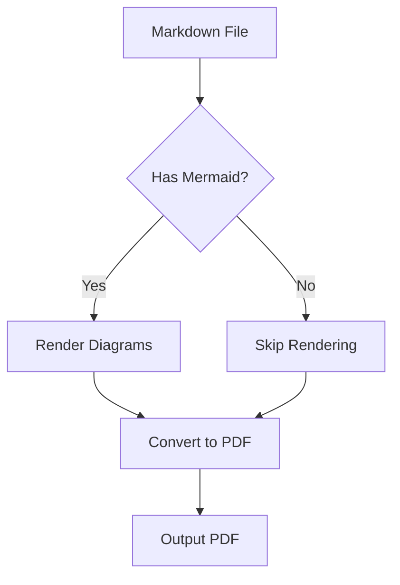
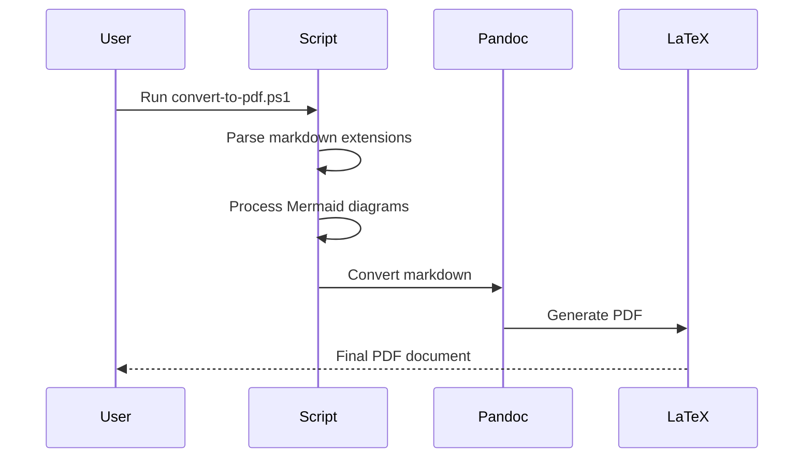

[title]
# Sample Document

**Author**: Your Name
**Organization**: Your Organization
January 2025

*A demonstration of all converter features*
[/title]

[toc:all]

## Introduction

This sample document demonstrates all the features available in the Markdown to PDF converter. Each section below showcases a different capability.

## Cover Pages and Metadata

The document you're reading started with a `[title]...[/title]` block that generated the cover page. The converter automatically extracts the title, author, and date for PDF metadata.

## Table of Contents

The `[toc:all]` marker above generated a table of contents along with lists of figures and tables. Other options include:

- `[toc]` - Basic table of contents only
- `[toc:figures]` - TOC plus list of figures
- `[toc:tables]` - TOC plus list of tables

## Callout Boxes

The converter supports five types of callout boxes using GitHub-style syntax:

> [!NOTE]
> This is an informational note. Use it to provide additional context or explanations that readers might find helpful.

> [!TIP]
> This is a helpful tip. Perfect for sharing best practices or shortcuts that can improve the reader's experience.

> [!WARNING]
> This is a warning. Use it to alert readers about potential issues or things they should be careful about.

> [!IMPORTANT]
> This is important information. Use it for key points that readers must understand.

> [!CAUTION]
> This requires caution. Use it for critical warnings about actions that could cause problems.

## Mermaid Diagrams

The converter automatically renders Mermaid diagrams with intelligent scaling:



Here's a more complex sequence diagram:



## Tables

Tables are formatted with proper styling including smaller font size and single spacing:

Table: Sample Data Table

| Feature | Status | Notes |
|---------|--------|-------|
| Cover Pages | ✓ | Uses [title] markers |
| TOC | ✓ | Multiple variants |
| Diagrams | ✓ | Mermaid CLI required |
| Callouts | ✓ | 5 types supported |
| Citations | ✓ | APA 7th edition |

## Code Blocks

Code blocks are styled with a subtle background. When using the `-LineNumbers` flag, line numbers appear:

```python
def convert_document(input_file, output_file):
    """Convert a markdown file to PDF."""
    content = read_file(input_file)
    processed = process_extensions(content)
    generate_pdf(processed, output_file)
    return True
```

Inline code like `variable_name` gets a highlighted background.

## Page Breaks

Use the `[pagebreak]` marker to force a new page.

[pagebreak]

## Citations and Bibliography

When a `references/bibliography.bib` file is present, you can use citations:

- Parenthetical: According to recent research [@example2024], this approach works well.
- Narrative: @samplebook2023 provides comprehensive coverage of this topic.
- Multiple: Several studies support this [@example2024; @conference2024].

## Figures

Images with captions are automatically formatted as proper figures:

{ width=50% }

## Command Line Options

This document can be converted with various options:

```powershell
# Basic conversion
.\convert-to-pdf.ps1 -File "sample.md"

# Draft mode
.\convert-to-pdf.ps1 -File "sample.md" -Draft

# Confidential with custom spacing
.\convert-to-pdf.ps1 -File "sample.md" -Confidential -LineSpacing 1.15

# Full options
.\convert-to-pdf.ps1 -File "sample.md" -Draft -Confidential -LineNumbers -RunningTitle "Sample Doc" -OpenAfterBuild
```

## Conclusion

This converter provides a comprehensive solution for creating professional PDF documents from Markdown source files. The combination of:

- APA 7th edition formatting
- Automatic diagram rendering
- Multiple callout types
- Flexible TOC options
- Bibliography support

...makes it suitable for academic papers, technical documentation, and professional reports.

---

## References
