# Feature Demonstration Guide

**Markdown to PDF Converter**

---

**Author**: Documentation Team
**Date**: January 2025

*A comprehensive showcase of all converter capabilities*

## Introduction

Welcome to the feature demonstration guide for the Markdown to PDF converter. This document showcases every capability available, serving as both documentation and a test file for validating converter functionality.

> [!TIP]
> Convert this file with different options to see how each feature renders:
> ```powershell
> .\convert-to-pdf.ps1 -File "sample.md" -OpenAfterBuild
> ```

## Document Structure

### Cover Pages

The document you're reading began with a `[title]...[/title]` block that generated the professional cover page. The converter automatically extracts metadata for the PDF properties.

```markdown
[title]
# Document Title
**Author**: Name
January 2025
[/title]
```

### Table of Contents

The `[toc:all]` marker generates a complete table of contents with lists of figures and tables. Available variants:

| Marker | Output |
| ------ | ------ |
| `[toc]` | Table of contents only |
| `[toc:figures]` | TOC + list of figures |
| `[toc:tables]` | TOC + list of tables |
| `[toc:all]` | TOC + figures + tables |

## Visual Elements

### Callout Boxes

Five callout types provide visual emphasis for different content categories:

> [!NOTE]
> **Informational notes** provide additional context or background information that supplements the main content.

> [!TIP]
> **Tips** share best practices, shortcuts, or recommendations that improve the reader's experience.

> [!WARNING]
> **Warnings** alert readers to potential issues or situations requiring attention.

> [!IMPORTANT]
> **Important notices** highlight critical information that readers must understand before proceeding.

> [!CAUTION]
> **Caution notices** warn about actions that could cause significant problems or data loss.

### Mermaid Diagrams

The converter renders Mermaid diagrams with automatic scaling to fit the page:

```mermaid
flowchart LR
    subgraph Input
        A[📄 Markdown]
    end
    subgraph Processing
        B{Mermaid?}
        C[🎨 Render]
        D[⚙️ Pandoc]
    end
    subgraph Output
        E[📕 PDF]
    end

    A --> B
    B -->|Yes| C --> D
    B -->|No| D
    D --> E
```



**Sequence diagrams** illustrate process flows:

```mermaid
sequenceDiagram
    participant U as 👤 User
    participant S as ⚙️ Script
    participant P as 📝 Pandoc
    participant L as 🔧 LaTeX

    U->>S: convert-to-pdf.ps1
    activate S
    S->>S: Parse extensions
    S->>S: Render Mermaid
    S->>P: Process markdown
    activate P
    P->>L: Generate PDF
    activate L
    L-->>U: 📕 Final document
    deactivate L
    deactivate P
    deactivate S
```



[pagebreak]

## Data Presentation

### Tables

Tables render with professional styling, including smaller font size and proper alignment:

Table: Converter Feature Matrix

| Feature | Status | Requirement | Notes |
| ------- | :----: | ----------- | ----- |
| Cover Pages | ✅ | Built-in | Uses `[title]` markers |
| Table of Contents | ✅ | Built-in | Four variants available |
| Mermaid Diagrams | ✅ | Optional | Requires Mermaid CLI |
| Callout Boxes | ✅ | Built-in | Five types supported |
| Citations | ✅ | Optional | Requires bibliography.bib |
| LaTeX Math | ✅ | Built-in | Full equation support |
| Page Breaks | ✅ | Built-in | Manual page control |
| Draft Mode | ✅ | Built-in | Watermark overlay |

### Code Blocks

Code blocks feature syntax highlighting and optional line numbers (use `-LineNumbers` flag):

```python
def convert_document(input_path: str, output_path: str) -> bool:
    """
    Convert a Markdown file to PDF with full feature support.

    Args:
        input_path: Path to the source Markdown file
        output_path: Path for the generated PDF

    Returns:
        True if conversion succeeded, False otherwise
    """
    content = read_markdown(input_path)
    processed = apply_extensions(content)
    return generate_pdf(processed, output_path)
```

Inline code like `variable_name` or `function()` renders with a highlighted background.

### Mathematical Equations

LaTeX math expressions render beautifully:

The quadratic formula: $x = \frac{-b \pm \sqrt{b^2 - 4ac}}{2a}$

Block equations for complex expressions:

$$
\int_{-\infty}^{\infty} e^{-x^2} dx = \sqrt{\pi}
$$

$$
\sum_{n=1}^{\infty} \frac{1}{n^2} = \frac{\pi^2}{6}
$$

## Academic Features

### Citations

With a `references/bibliography.bib` file, citations follow APA 7th edition:

- **Parenthetical**: According to recent research [@example2024], this approach is effective.
- **Narrative**: @samplebook2023 provides comprehensive coverage of the methodology.
- **Multiple sources**: Several studies support these findings [@example2024; @conference2024].

### Figures

Images with alt text automatically become captioned figures:

```markdown
{ width=50% }
```

## Command Reference

### Basic Usage

```powershell
.\convert-to-pdf.ps1 -File "document.md"
```

### Advanced Options

```powershell
# Academic paper with citations
.\convert-to-pdf.ps1 -File "paper.md" -LineSpacing 2.0

# Technical documentation
.\convert-to-pdf.ps1 -File "manual.md" -LineNumbers -TwoColumn

# Draft for review
.\convert-to-pdf.ps1 -File "draft.md" -Draft -Confidential -OpenAfterBuild

# Custom header
.\convert-to-pdf.ps1 -File "report.md" -RunningTitle "Q4 Report" -OpenAfterBuild
```

## Conclusion

This converter delivers professional-quality PDF output from Markdown source files, combining:

- **Academic standards** — APA 7th edition formatting with proper citations
- **Visual richness** — Mermaid diagrams, callout boxes, and LaTeX math
- **Flexibility** — Multiple layout options and customization parameters
- **Ease of use** — Simple command-line interface with sensible defaults

Whether creating academic papers, technical documentation, or professional reports, this tool streamlines the journey from Markdown to polished PDF.

---

## References
