[title]

# GCX AI Adoption Vision 2026

**Microsoft Global Customer Experience (GCX)**
*Human-Centered AI Empowerment Strategy*

**Version 2.1** | January 28, 2026

**Authors**: Lin Zhu Aumont & Fabio Correa
*Under advisement of the GCX AI Leads Community*

**Microsoft Confidential** | © 2026 Microsoft Corporation
[/title]

[toc]

> **Executive Summary**: This document presents GCX's evidence-based strategy for AI adoption, grounded in validated research (N=523, 85.2% predictive accuracy). Key insight: traditional approaches (productivity messaging, training programs) do not drive AI adoption. What works: demonstrating value (β=0.505), creating engaging experiences (β=0.217), and leveraging peer influence (β=0.136). With 67% of users persuadable through targeted intervention, GCX has a unique opportunity to lead Microsoft's AI transformation while directly improving M365 Copilot customer retention. All initiatives align with Microsoft's Secure Future Initiative (SFI) and Responsible AI standards.

---

## The Opportunity Before Us

We stand at a defining moment. AI is transforming how work gets done across every industry, and GCX has a unique opportunity to lead Microsoft's transformation—not by racing to deploy the most tools, but by getting AI adoption *right*.

The challenge isn't technology. It's people.

### Why This Matters Now: The M365 Copilot Renewal Imperative

There is a commercial reality that makes this work urgent: **Customers who don't succeed with their M365 Copilot pilots won't renew.** Pilot success isn't determined by the technology—it's determined by whether employees actually adopt it and realize value.

When an organization invests in Copilot licenses but employees don't use them meaningfully, leadership perceives the subscription as wasted spend. They don't attribute the failure to inadequate change management; they attribute it to the product. The consequence: non-renewal, lost revenue, and—perhaps more damaging—a customer who becomes skeptical of Microsoft's entire AI value proposition.

The research quantifies this risk:

- **17% of users have trust barriers** that prevent adoption entirely—they will not engage with Copilot
- **30% are evaluating** and require case studies and ROI evidence before committing
- **67% are persuadable** with the right approach—this is the movable middle that determines pilot outcomes
- **Leaders adopt AI at nearly double the rate of individual contributors**—creating visibility gaps in adoption challenges

This is why GCX's AI adoption expertise isn't merely an internal capability development exercise. **Every insight we gain about driving successful AI adoption directly translates to customer success with Copilot.** When we understand what actually motivates people to change how they work, we can help our customers realize that same value—and protect Microsoft's recurring revenue.

The stakes are significant. Poorly executed AI adoption creates organizational cynicism and customer churn. Well-executed AI adoption creates advocates who expand their investment. GCX can be the differentiator.

### What the Research Demonstrates

After extensive research and real-world observation, we've learned that successful AI adoption depends far less on having the best tools and far more on understanding what actually motivates people to change how they work. This document captures that learning and charts a path forward.

---

## Our Strategic Aspiration

> **GCX is leading Microsoft in delivering easy, personalized, human-centered Customer Experiences — powered by trusted AI that amplifies our people, deepens connection and trust, accelerates how we learn and operate, and enables our teams and organization to grow and create meaningful, measurable impact at scale.**

Note what's at the center of this vision: **people**. We deliberately chose "human-centered AI empowered" over "AI first" because language shapes culture. Every time we articulate "human-centered," we reinforce that AI exists to serve people—not the other way around.

This isn't merely philosophy. Research consistently demonstrates that human-AI collaboration outperforms either humans or AI operating independently. When employees trust that AI augments rather than replaces them, they engage more deeply, experiment more freely, and ultimately deliver superior outcomes for customers.

---

## The Three Pillars: Where AI Creates Value

Sustainable AI adoption doesn't happen by focusing on technology alone. It requires creating value across three interconnected dimensions:

**Customer Impact** is our north star—faster insights, proactive engagement, and deeper empathy at scale. But here's the crucial insight: customer impact flows *through* employees. When our people feel empowered, confident, and supported, that energy translates directly into better customer experiences.

**Employee Impact** is therefore not secondary—it's foundational. We must reduce friction, build trust, and create growth opportunities. People who feel threatened by AI resist it; people who feel amplified by AI embrace it.

**Organizational Impact** ensures we can sustain and scale what works. This means transparent governance, psychological safety for experimentation, and the discipline to reuse rather than rebuild.

Underneath all three pillars sits our **Agentic Capability Layer**—the advanced AI systems that can orchestrate, reason, plan, and execute multi-step workflows. But these capabilities only create value when they're deployed in service of the three pillars above.

---

## The Evidence Base for AI Adoption

This strategy is grounded in empirical research, not assumptions.

Using the AI Readiness Scale for Individuals (AIRS-16)—a validated instrument tested with 523 participants that explains **85.2% of variance** in adoption intentions—we identified what actually drives AI adoption. The model predicts actual behavior: the correlation between stated intent and subsequent action is **ρ = .69** (validated).

### What Drives Adoption

| What Drives Adoption         |   Impact (β)   | Why It Matters                                                                                                                                                                          |
| ---------------------------- | :-------------: | --------------------------------------------------------------------------------------------------------------------------------------------------------------------------------------- |
| **Price Value**        | **0.505** | When people clearly see the*total value* relative to *total investment*, they adopt. This was **by far** the strongest predictor—2.3x more influential than the next factor. |
| **Hedonic Motivation** | **0.217** | When using AI feels satisfying and even fun, people come back. Mandatory training doesn't create this—good experiences do.                                                             |
| **Social Influence**   | **0.136** | When respected colleagues share how AI helped them, others follow. Champions and success stories matter enormously.                                                                     |
| Trust in AI*(marginal)*    |      0.106      | Trust matters for specific segments (especially Anxious Avoiders), but isn't a universal predictor across all users.                                                                    |

### Understanding "Price Value"

This is the most important concept in the research, and it's often misunderstood. **Price Value isn't about licensing costs**—it's about perceived worth relative to *total* investment:

- **Direct costs**: Licensing, subscriptions, infrastructure
- **Indirect costs**: Learning curve time, workflow disruption, change management effort
- **Hidden costs**: Data privacy concerns, vendor lock-in anxiety, integration complexity
- **Opportunity costs**: Time spent learning AI vs. doing current work

A $20/month tool that wastes hours of time has *low* Price Value. An enterprise solution with seamless integration and immediate productivity gains has *high* Price Value regardless of price point. This is why "just rolling out Copilot" without addressing the total cost of adoption fails—and why organizations that invest in change management succeed.

### What Doesn't Drive Adoption (Critical Finding)

The traditional technology adoption playbook does not move the needle on AI. Our research found that **conventional technology adoption drivers showed no significant effect** on AI adoption:

| Traditional Approach                            | Statistical Impact | Implication                                           |
| ----------------------------------------------- | :----------------: | ----------------------------------------------------- |
| **Performance Expectancy** (productivity) |  Not significant  | "You'll be more productive" does not resonate         |
| **Effort Expectancy** (ease of use)       |  Not significant  | Ease of use alone is insufficient                     |
| **Facilitating Conditions** (support)     |  Not significant  | Additional training does not drive adoption           |
| **Habit** (prior experience)              |  Not significant  | Past technology adoption does not predict AI adoption |

**This represents a paradigm shift.** Organizations are investing heavily in productivity messaging, ease-of-use improvements, and training programs—yet the data indicates none of these are significant predictors of whether someone will actually adopt AI.

> **Strategic Implication**: Employees aren't evaluating AI by asking "Will this make me more productive?" They're asking "Is this worth my investment, and can I trust what it produces?" Lead with demonstrated value, not productivity claims. Create engaging experiences, not mandatory training. Leverage champions who can share authentic success stories.

### Workforce Segmentation: Four Distinct Adoption Profiles

Not everyone is at the same point in their AI journey. K-means cluster analysis identified four statistically distinct segments. Segment-specific interventions are more effective than uniform programs:

| Segment                     |    Size    | Profile                                  | Investment Priority           |
| --------------------------- | :---------: | ---------------------------------------- | ----------------------------- |
| **AI Enthusiasts**    | 16% (n=84) | High trust, low anxiety, already engaged | Low—maintain engagement      |
| **Cautious Adopters** | 30% (n=157) | See potential, require evidence          | Medium—provide proof points  |
| **Moderate Users**    | 37% (n=191) | Pragmatic, will follow peers             | Medium—reduce friction       |
| **Anxious Avoiders**  | 17% (n=91) | Trust barriers, significant resistance   | High effort, uncertain return |

**Resource Allocation Guidance**: The **Cautious Adopters** and **Moderate Users** represent **67% of the workforce** and are most responsive to intervention. This is where targeted investment delivers the greatest return.

**AI Enthusiasts (16%)** are a strategic asset. Recruit them as **champions**. Provide early access programs and platforms to share success stories. Their credibility with peers accelerates adoption across other segments.

**Cautious Adopters (30%)** require evidence before committing. Deliver **proof points**: case studies, ROI calculators, peer testimonials, and low-commitment pilot programs. Address concerns directly with transparency.

**Moderate Users (37%)** represent the organizational mainstream—pragmatic professionals who follow peer behavior. **Reduce friction**: clear value propositions, streamlined onboarding, visible quick wins. Leverage Social Influence by demonstrating peer adoption.

**Anxious Avoiders (17%)** have trust barriers that prevent engagement. Do not push features—address underlying concerns with human support, transparency, and gradual exposure. Evaluate whether this segment warrants investment relative to more responsive segments.

---

## GCX Agentic Guidance Framework

Not every problem requires sophisticated AI. Reaching for advanced solutions when simpler ones would suffice creates unnecessary complexity, cost, and risk. This framework helps GCX teams determine when advanced agentic capabilities are required and how to engage effectively.

### When is a More Sophisticated Agent Required?

Consider an advanced agent when:

- **Task spans multiple systems** — Workflows require orchestration beyond basic automation across tools and platforms
- **Proactive intelligence is needed** — Pattern detection, anticipation, or recommendations (vs. reactive responses)
- **Reasoning and planning are essential** — Multi-step execution with agentic capabilities
- **Existing agents show limitations** — Narrow data scope, insufficient training, or reliability gaps
- **Scale and trust are critical** — Use case impacts CX/EX at scale, requiring consistency and governance

### Decision Guide for GCX Teams

```mermaid
flowchart TD
    START(["🚀 New AI Capability Request"]) --> Q1{"Is it simple &<br/>rule-based?"}

    Q1 -->|Yes| SIMPLE["✅ Improve existing<br/>automation"]
    Q1 -->|No| Q2{"Requires reasoning,<br/>planning, or multi-step?"}

    Q2 -->|No| LIGHT["✅ Lightweight agent<br/>may suffice"]
    Q2 -->|Yes| Q3{"Does a similar agent<br/>already exist in GCX?"}

    Q3 -->|Yes| REUSE["🔄 REUSE FIRST<br/>Avoid fragmentation"]
    Q3 -->|No| Q4{"Cross-team or<br/>global impact?"}

    Q4 -->|No| TEAM["✅ Team-level<br/>advanced agent"]
    Q4 -->|Yes| GOV["🏛️ Governance Review +<br/>Advanced Agent"]

    style START fill:#e3f2fd,stroke:#1976d2
    style SIMPLE fill:#c8e6c9,stroke:#388e3c
    style LIGHT fill:#c8e6c9,stroke:#388e3c
    style REUSE fill:#fff9c4,stroke:#f9a825
    style TEAM fill:#c8e6c9,stroke:#388e3c
    style GOV fill:#ffccbc,stroke:#e64a19
```

**The key principle: reuse before building.** Every new agent adds complexity to our ecosystem. Fragmentation increases governance burden and confuses users. Partner with the Agent J.ai integration team for reuse opportunities before building new capabilities.

### GCX Requirement Provider Responsibilities

When requesting new agentic capabilities, come prepared with:

| Requirement Area              | What to Provide                                                           |
| ----------------------------- | ------------------------------------------------------------------------- |
| **Business Problem**    | Clear problem statement, desired outcomes, measurable success criteria    |
| **Scenarios & Data**    | Sample workflows, actual pain points, real data examples                  |
| **Trust & Compliance**  | Human-in-loop expectations, accountability requirements, compliance needs |
| **System Dependencies** | CX, EX, and Org system integrations; data sources; tool connections       |

Good requirements accelerate development; vague ones lead to rework.

### Governance & Alignment Expectations

Every AI capability we deploy must be:

- **Visible** — Registered in the GCX agent inventory
- **Aligned** — Consistent with Microsoft enterprise AI policies and GCX AI Governance V-team standards
- **Measured** — Defined metrics for reliability, adoption, and trust
- **Iterative** — Feedback loops for continuous learning and improvement

This governance structure maintains trust at scale and ensures sustainable adoption.

### Secure Future Initiative (SFI) Alignment

All GCX AI capabilities must align with Microsoft's Secure Future Initiative principles:

| SFI Principle               | Application to AI Adoption                                                               |
| --------------------------- | ---------------------------------------------------------------------------------------- |
| **Secure by Design**  | AI systems incorporate security from initial architecture; no security as afterthought   |
| **Secure by Default** | AI capabilities deploy with security controls enabled; users opt-in to reduced security  |
| **Secure Operations** | Continuous monitoring, threat detection, and incident response for all AI workloads      |
| **Identity & Access** | Strong authentication and least-privilege access for AI systems and data                 |
| **Data Protection**   | Customer and organizational data protected in transit, at rest, and during AI processing |

**Accountability**: AI capability owners are responsible for SFI compliance throughout the capability lifecycle. Security reviews are required before production deployment.

### Responsible AI Commitment

GCX AI adoption is grounded in Microsoft's Responsible AI Standard. Every AI capability must address:

| RAI Principle                  | GCX Implementation                                                               |
| ------------------------------ | -------------------------------------------------------------------------------- |
| **Fairness**             | AI systems treat all users equitably; bias testing required before deployment    |
| **Reliability & Safety** | Systems perform reliably and safely; failure modes identified and mitigated      |
| **Privacy & Security**   | Personal data protected; data minimization practiced; security controls enforced |
| **Inclusiveness**        | AI capabilities accessible to users of all abilities and backgrounds             |
| **Transparency**         | Users understand when they're interacting with AI and how decisions are made     |
| **Accountability**       | Clear ownership and human oversight for AI system behavior and outcomes          |

**Human-in-the-Loop**: For high-stakes decisions affecting customers or employees, human review and override capability is required. AI augments human judgment; it does not replace accountability.

**Impact Assessment**: New AI capabilities require Responsible AI impact assessment before deployment, with ongoing monitoring for unintended consequences.

---

## Strategic Impact

### Customer Outcomes

We are accelerating insight to action, enabling proactive engagement, and using AI to deepen—not replace—human empathy. Success metrics include reduced time-to-insight, increased proactive outreach, improved customer sentiment scores, and accelerated issue resolution.

### Employee Outcomes

We are reducing operational friction, building capability confidence, and creating professional growth opportunities. Success metrics include reduced time on routine tasks, higher AI adoption rates, improved cross-timezone collaboration, and employees who feel empowered rather than threatened.

> *"Initial AI impact lands on employees who must change behavior — their experience determines customer experience success."* — Larry Gandy

This insight is foundational. Employee experience and customer experience are inseparable.

### Organizational Outcomes

We are building scalable workflows, transparent governance, and a learning culture. Success metrics include higher throughput per person, full compliance with AI policies, increased experimentation, and reduced tool fragmentation.

---

## Our Team

### Sponsors

**Nicole McKinley** and **Shireen Asous** provide executive sponsorship, strategic direction, and organizational enablement. Their support ensures we have the visibility and resources to succeed.

### Core Team

| Role                           | Person         | Focus                                       |
| ------------------------------ | -------------- | ------------------------------------------- |
| **AI Strategy Lead**     | Lin Zhu Aumont | Vision, roadmap, cross-functional alignment |
| **AI Architect**         | Fabio Correa   | Technical architecture, agentic framework   |
| **Research & Analytics** | Fabio Correa   | AIRS methodology, adoption measurement      |
| **Portfolio Alignment**  | Greg Stephens  | Intake, prioritization, coherence           |
| **Change Management**    | TBD            | Adoption strategies, communication          |

### Partners

- **GCX AI Governance V-team** — Policy alignment, compliance, inventory management
- **AI Leads Community** — Strategic guidance, cross-org learnings, best practices

### Stakeholders

The **GCX Leadership Team** provides strategic alignment, executive support, and success storytelling that amplifies our impact across the organization.

---

## The Road Ahead

Our implementation follows proven change management principles, integrating the ADKAR model (Awareness, Desire, Knowledge, Ability, Reinforcement) with our research findings. McKinsey (2025) found that high performers are **3x more likely to redesign workflows** rather than simply augmenting existing processes, and **51% of organizations experienced negative consequences** from AI deployment due to inadequate change management.

### Q1 2026: Foundation (ADKAR: Awareness + Desire)

The first phase focuses on building **awareness** of why AI adoption matters and creating **desire** to participate. Key activities:

- **Executive sponsorship secured** — Nicole McKinley and Shireen Asous providing visible support
- **Agent inventory established** — Documenting what AI capabilities exist today
- **AIRS baseline assessment** — Understanding where our teams fall across the four segments
- **3-5 pilot use cases defined** — High-visibility, low-risk opportunities with clear ROI potential
- **Champion network launched** — Recruiting from the 16% AI Enthusiasts segment

### Q2 2026: Activation (ADKAR: Knowledge + Ability)

The second phase builds **knowledge** through targeted enablement and develops **ability** through hands-on experience:

- **First agentic capability deployed** — Real solution solving real problems
- **Value demonstration workshops** — Role-specific training showing concrete benefits (addressing Price Value β=0.505)
- **Peer success story campaigns** — Champions sharing wins with Moderate Users (Social Influence β=0.136)
- **Continuous feedback loops** — Weekly check-ins to identify and remove barriers
- **Mid-point AIRS re-assessment** — Measuring segment movement

### Q3-Q4 2026: Scale (ADKAR: Reinforcement)

The final phase focuses on **reinforcement** to make AI adoption stick:

- **Expansion to Moderate Users** — The 67% persuadable middle, informed by Q2 learnings
- **Advanced capabilities rollout** — Building on success foundation
- **Enterprise playbook contribution** — Sharing validated approaches across Microsoft
- **Transformation case study** — Documenting the journey for external publication
- **Final AIRS assessment** — Measuring overall readiness improvement

---

## Success Metrics

| Metric                         | 2026 Target               |
| ------------------------------ | ------------------------- |
| AI readiness score improvement | +15% organization average |
| Time saved per person per week | 5+ hours                  |
| Insight quality score          | >4.0 out of 5.0           |
| Agent inventory coverage       | 100%                      |
| Champion network size          | 50+ active members        |
| Human-in-loop override rate    | <10% (healthy threshold)  |

---

## Guiding Principles

1. **Amplify people, don't replace them.** AI empowers humans to do more meaningful work.
2. **Demonstrate value first.** Establish ROI before requesting behavior change.
3. **Make it engaging.** Compelling experiences drive adoption; mandates do not.
4. **Leverage social proof.** Champions and peer success stories accelerate adoption.
5. **Reuse before building.** Consolidate capabilities to reduce fragmentation.
6. **Govern transparently.** Clear accountability and decision rights build trust.
7. **Learn continuously.** Foster psychological safety to experiment, iterate, and improve.

---

## The Path Forward

This vision is an invitation to every team in GCX: join us in building an AI-empowered organization that puts people first, delivers exceptional customer experiences, and leads Microsoft's transformation.

The evidence base is established. The implementation path is defined. The opportunity is immediate.

We look forward to building this together.

---

## References & Research Foundation

The insights in this document are grounded in peer-reviewed research and validated psychometric methodology.

### Primary Research

**Correa, F.** (2025). *Artificial Intelligence Readiness Scale: Extending UTAUT2 for Enterprise AI Adoption*. Doctoral dissertation, Touro University Worldwide.

- **Sample**: N = 523 participants (students, professionals, leaders)
- **Validation**: Split-sample design with independent EFA and CFA samples
- **Model Fit**: Excellent (CFI = .975, TLI = .960, RMSEA = .065)
- **Variance Explained**: 85.2% of AI adoption intentions
- **Intent-Behavior Correlation**: ρ = .69 (validated)

### Theoretical Foundation

**Venkatesh, V., Thong, J. Y. L., & Xu, X.** (2012). Consumer acceptance and use of information technology: Extending the unified theory of acceptance and use of technology. *MIS Quarterly, 36*(1), 157–178.

> The UTAUT2 framework provides the foundational constructs (Performance Expectancy, Effort Expectancy, Social Influence, Facilitating Conditions, Hedonic Motivation, Price Value, and Habit) that were extended with Trust in AI for the AIRS instrument.

### Supplementary Research

**Davis, F. D.** (1989). Perceived usefulness, perceived ease of use, and user acceptance of information technology. *MIS Quarterly, 13*(3), 319–340.

**Rogers, E. M.** (2003). *Diffusion of Innovations* (5th ed.). Free Press.

**Ajzen, I.** (1991). The theory of planned behavior. *Organizational Behavior and Human Decision Processes, 50*(2), 179–211.

### Change Management Research

**McKinsey & Company.** (2025). *The state of AI in 2025: Agents, innovation, and transformation*. McKinsey Global Survey.

- High performers 3x more likely to redesign workflows (p. 12)
- 51% of organizations experienced negative consequences from AI deployment (p. 18)
- 88% of organizations use AI, but only 33% have scaled beyond pilots (p. 4)

**Prosci.** (2024). *Best Practices in Change Management*. Prosci Inc.

> The ADKAR model (Awareness, Desire, Knowledge, Ability, Reinforcement) provides a structured framework for individual change that complements AIRS segment-specific interventions.

**American Society for Quality.** (2024). *ASQE Insights on Excellence Benchmarking Highlights Report*. ASQ Quality Press.

- 25% of organizations cite change management as primary workforce improvement priority

---

*Questions? Reach out to Lin Zhu Aumont (AI Strategy Lead) or the GCX AI Governance V-team.*

**Microsoft Confidential** | © 2026 Microsoft Corporation

